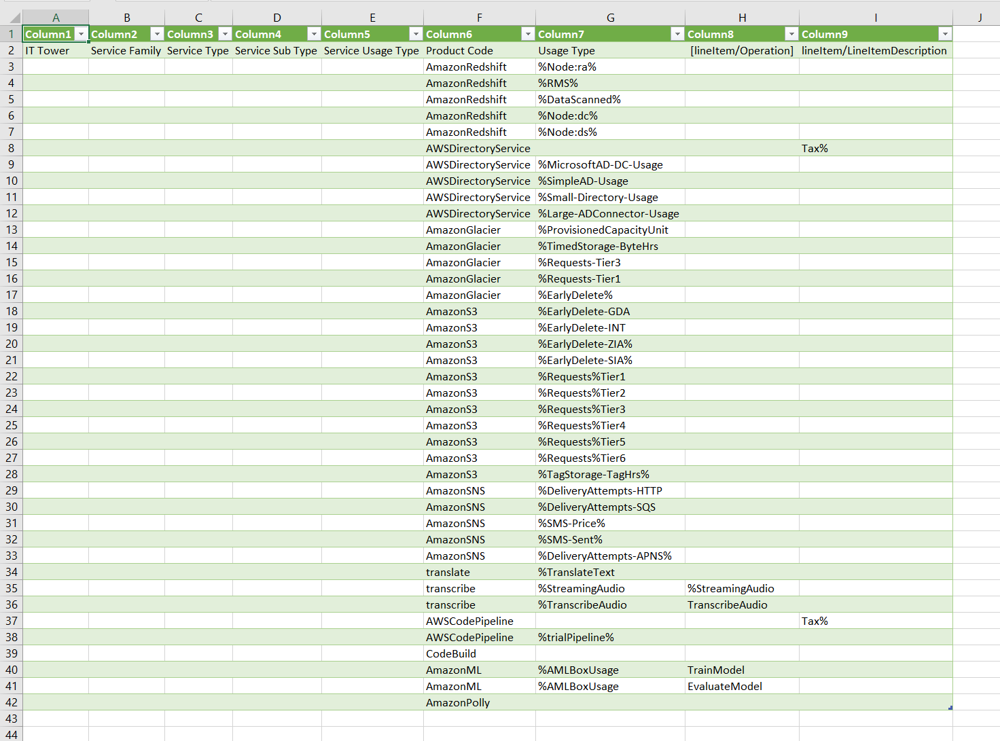
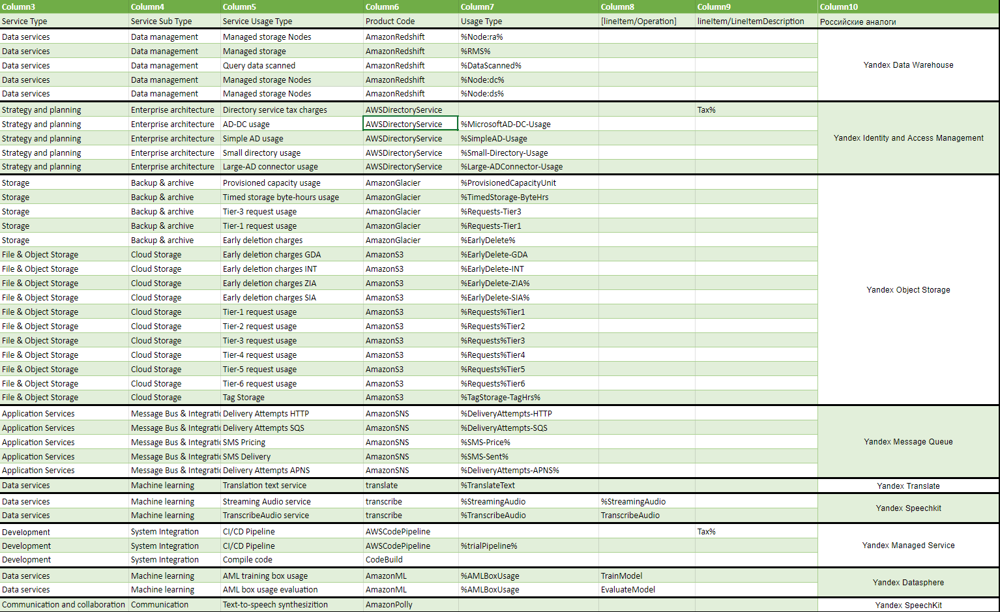

### Состав команды:
1. Абдрахманов Мартин
2. Горлов Игорь
3. Язев Григорий
4. Конопля Алексей

### Цель работы:

Знакомство с облачными сервисами. Понимание уровней абстракции над инфраструктурой в облаке. Формирование понимания типов потребления сервисов в сервисной-модели. Сопоставление сервисов между разными провайдерами. Оценка возможностей миграции на отечественные сервисы.

### Дано:

1. Слепок данных биллинга от провайдера после небольшой обработки в виде SQL-параметров. Символ % в начале/конце означает, что перед/после него может стоять любой набор символов.
2. Google с документациями провайдера

### Начальные данные:

**Amazon Redshift** - использует SQL для анализа структурированных и частично структурированных данных в хранилищах данных, операционных базах данных и озерах данных с помощью оборудования, спроектированного AWS, и машинного обучения, чтобы обеспечить максимальную окупаемость при любом масштабе.

**AWS Directory Service** (также известный как AWS Managed Microsoft AD) - позволяет выполнять операции с поддержкой каталогов и ресурсов AWS для использования управляемых AD на AWS .

**Amazon Glacier** - онлайн-хранилище файлов от компании Amazon, предоставляющее надёжное хранение данных в целях архивации и резервного копирования

**Amazon Simple Storage Service (Amazon S3)** – это сервис хранения объектов, предлагающий лучшие в отрасли показатели производительности, масштабируемости, доступности и безопасности данных. Клиенты любой величины и из любой промышленной отрасли могут хранить и защищать необходимый объем данных для практически любого примера использования. Например, для озер данных, облачных приложений и мобильных приложений. Выгодные классы хранилища и простые в использовании инструменты администрирования позволяют оптимизировать затраты, организовать данные и точно настроить ограничения доступа в соответствии с потребностями бизнеса или законодательными требованиями.

**Amazon SNS** - сервис уведомлений, использующий два метода отправки сообщений: A2A и A2P. A2A обеспечивает высокую пропускную способность для обмена push-уведомлениями между распределенными системами, микросервисами и бессерверными приложениями на основе событий по модели «многие ко многим». К таким приложениям относятся Amazon Simple Queue Service (SQS), Amazon Kinesis Data Firehose, AWS Lambda и другие конечные точки HTTPS. A2P позволяет отправлять клиентам текстовые SMS-сообщения, push-уведомления и электронные письма.

**Amazon Translate** – это сервис нейронного машинного перевода, обеспечивающий быстрый, высококачественный, доступный по стоимости перевод с пользовательскими настройками с одного языка на другой.

**Amazon Transcribe** - сервис автоматического распознавания речи, использующий машинное обучение для преобразования аудио в текст. Amazon Transcribe можно использовать в качестве автономной транскрибирования или для добавления возможностей преобразования речи в текст в любое приложение.

**AWS CodePipeline** — это полностью управляемый сервис непрерывной доставки, который помогает автоматизировать работу конвейеров выпуска для быстрого и надежного обновления приложений и инфраструктуры.

**AWS CodeBuild** — это полностью управляемый сервис непрерывной интеграции, который компилирует исходный код, выполняет тестирование и формирует готовые к развертыванию пакеты программного обеспечения.

**AmazonML** - это управляемый сервис для создания моделей машинного обучения и прогнозов, который позволяет разрабатывать надежные масштабируемые интеллектуальные приложения. Сервис Amazon ML дает возможность использовать мощные технологии машинного обучения, и при этом не требуется опыт работы с алгоритмами и методами машинного обучения.

**AmazonPolly** - использует технологии глубокого обучения реалистичного синтеза человеческой речи, чтобы можно было преобразовать статьи в речь. Используйте десятки естественно звучащих голосов Amazon Polly для многих языков для создания приложений с речевым доступом.

### Итоговая таблица:

### Вывод:

В ходе выполнения лабораторной работы были проанализированы AWS сервисы. Информация о функциональных возможностях сервисов была взята из официальной документации и использована для заполнения таблицы, содержащей информацию о типах и подтипах сервисов, а также найдены российские аналоги.
