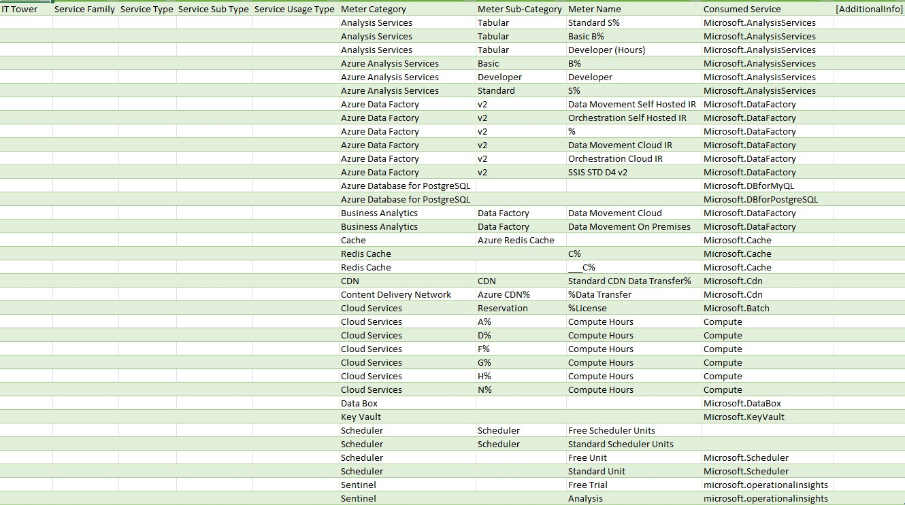
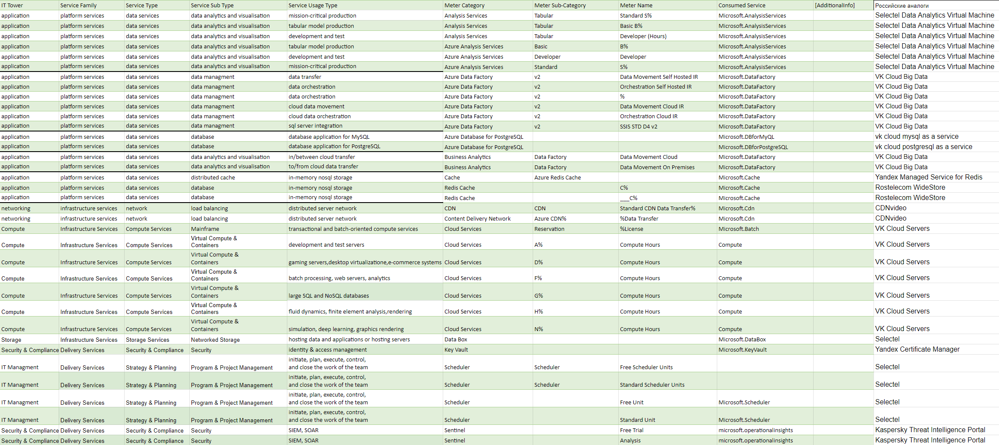

### Состав команды:
1. Абдрахманов Мартин
2. Горлов Игорь
3. Язев Григорий
4. Конопля Алексей

### Цель работы:

Знакомство с облачными сервисами. Понимание уровней абстракции над инфраструктурой в облаке. Формирование понимания типов потребления сервисов в сервисной-модели. Сопоставление сервисов между разными провайдерами. Оценка возможностей миграции на отечественные сервисы.

### Дано:

1. Слепок данных биллинга от провайдера после небольшой обработки в виде SQL-параметров. Символ % в начале/конце означает, что перед/после него может стоять любой набор символов.
2. Google с документациями провайдера

### Начальные данные:

**Azure Analysis Service** - это подсистема аналитических данных (VertiPaq), используемая для поддержки принятия решений и бизнес-аналитики. Она предоставляет возможности семантической модели данных корпоративного уровня для бизнес-аналитики (BI), анализа данных и создания отчетов, таких как Power BI, Excel, Reporting Services и другие средства визуализации данных.

**Azure Data Factory** - это управляемый облачный сервис от Microsoft Azure, предназначенный для оркестрации и автоматизации процессов обработки и передачи данных в облачной среде. Предоставляющий инструменты для создания, планирования и управления рабочими процессами (пайплайнами), которые перемещают, преобразовывают и загружают данные в и из различных источников и назначений.

**Azure SQL** - облачная служба управления реляционными базами данных от Microsoft Azure. Эта служба предоставляющая масштабируемую платформу для хранения и управления реляционными данными в облаке.

**Azure cache for redis** - это управляемый сервис кэширования в облаке Microsoft Azure, основанный на открытом исходном коде Redis. Redis — это высокопроизводительная система управления данными в памяти, используемая для хранения и обработки структурированных данных. Azure Cache for Redis предоставляет отдельные и масштабируемые кэши, доступные для приложений, развернутых в облаке Azure.

**Redis cache** - резидентная система управления базами данных класса NoSQL с открытым исходным кодом, работающая со структурами данных типа «ключ — значение». Используется как для баз данных, так и для реализации кэшей, брокеров сообщений. Ориентирована на достижение максимальной производительности на атомарных операциях.

**Azure CDN (Content Delivery Network)** — это служба доставки контента в облаке Microsoft Azure, которая обеспечивает быстрый и надежный доступ к содержимому веб-сайта или приложения, улучшая производительность и снижая задержки для конечных пользователей. Azure CDN обеспечивает глобальное распределение контента с использованием кэширования на рядах серверов по всему миру, что позволяет улучшить время загрузки страниц и снизить нагрузку на исходные серверы.

**Microsoft Azure Batch** - облачная служба высокопроизводительных вычислений, предоставляемая Microsoft Azure. Предназначенная для выполнения параллельных и распределенных вычислений в масштабах от небольших задач до крупных вычислительных задач.

**Microsoft Data Box** - это серия устройств и решений от Microsoft, предназначенных для упрощения и ускорения процесса передачи больших объемов данных между локальной инфраструктурой и облачными службами Azure. Это особенно полезно, когда требуется массовая миграция данных в облако или регулярная передача больших объемов данных.

**Azure Key Vault** – это служба облачных ключевых хранилищ (Cloud Key Management Service, KMS) от Microsoft Azure. Предоставляющая безопасное хранение и управление ключами шифрования, секретами и сертификатами, которые используются в облачных приложениях и службах.

**Microsoft scheduler** - Планировщик Azure дает возможность запускать различные задания, такие как вызов конечных устройств по протоколу HTTP/S, или размещать сообщения в очередях службы хранилища Azure по любому расписанию, что идеально подходит для вызова повторяющихся действий, например для очистки журналов, удаления резервных копий и других задач, связанных с техническим обслуживанием. Интегрируйте задания в приложения, которые будут запускаться сразу по расписанию или в любое запланированное время, и вызывайте службы как в Azure, так и на других ресурсах.

**Azure Sentinel** - это облачная служба от Microsoft Azure, предоставляющая решение для мониторинга безопасности и анализа событий безопасности в реальном времени. Azure Sentinel позволяет организациям эффективно обнаруживать, расследовать и реагировать на инциденты безопасности, а также проводить анализ безопасности с использованием облачных ресурсов.

### Итоговая таблица:

### Российские аналоги

**Data Analytics Virtual Machine** - Облачные серверы с предустановленным набором инструментов для анализа данных и машинного обучения. Не думайте о лицензиях, платите только за ресурсы облака по модели pay-as-you-go.

**VK Cloud Big Data** - облачный сервис от VK Cloud для работы с большими объемами данных, находящимися в облаке.

**Rostelecom WideStore** - Аналитическая колоночная СУБД с открытым кодом для обработки широких датасетов. Позволяет выполнять аналитические запросы в режиме реального времени на структурированных больших данных, используется для построения BI-решений и визуализации данных

**CdnVideo** – предлагает доставку контента на аудиторию любого размера, на все популярные платформы. Множество серверов со специализированным ПО для защиты и ускорения отдачи контента конечному пользователю в любой момент времени, из различных точек мира и на множество типов устройств.

**Yandex Certificate Manager** — сервис для получения и обновления TLS-сертификатов от Let's Encrypt, а также для загрузки собственных сертификатов, которые можно использовать для доступа к сайтам, шлюзам API Gateway и ресурсам Cloud CDN по протоколу HTTPS, а также для обработки TLS-трафика в Application Load Balancer.

### Вывод:

В ходе выполнения лабораторной работы были проанализированы Azure сервисы. Информация о функциональных возможностях сервисов была взята из официальной документации и использована для заполнения таблицы, содержащей информацию о типах и подтипах сервисов, а также найдены российские аналоги.
