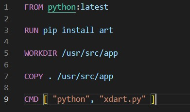
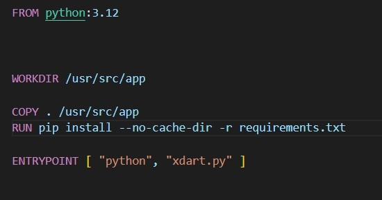
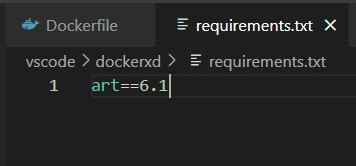

# Лабораторная работа №2
## Цель работы
Написать два Dockerfile – плохой и хороший. Плохой должен запускаться и работать корректно, но в нём должно быть не менее 3 “bad practices”. В хорошем Dockerfile они должны быть исправлены. В Readme описать все плохие практики из кода Dockerfile и почему они плохие, как они были исправлены в хорошем  Dockerfile, а также две плохие практики по использованию этого контейнера

## Начало работы
Для выполнения данной лабораторной работы был написан пройстейший docker файл, который запускает python программу.

### Пример плохого docker файла

Данный docker можно считать плохим, т.к.
1. Не указана версия python, а ведь возможно, при обновлениях (сейчас фактически написано python:latest), некоторые функции поменяются (хотя для нашего кода это маловероятно). Указание версии важно для одинаковой работы контейнера всегда и на всех устройствах
2. В документации к docker написано, что если коду не придется передавать аргументы и он будет выполнять одну и ту же команду, то следует использовать ENTRYPOINT (не сказал бы что это прям плохая практика, но рекомендации есть рекомендации)
3. Хоть тут это и не важно (мы одну библиотеку догружаем), но при большом количестве библиотек рекомендуется загружать их в одном RUN, дабы создавать меньше слоев в контейнере, а для удобства чтения программы, выделить для них отдельный текстовый файлик, со всеми пакетами.

### Пример хорошего docker файла

Исправления достаточно очевидны, 
1. У python добавлена определенная версия
2. RUN теперь будет сразу загружать все библиотеки из файла requirements.txt
3. CMD был заменен на ENTRYPOINT

