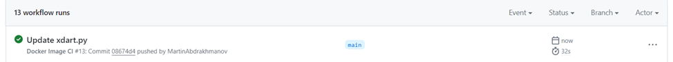

# Лабораторная работа №3
## Цель работы
Сделать, чтобы после пуша в ваш автоматически собирался докер образ и результат его сборки сохранялся. В нашем случае будем сохранять его на **dockerhub**.

## Начало работы
Для выполнения данной лабораторной работы был написан пройстейший docker файл, который запускает python программу.

### Docker файл

### Файл с библиотеками

### Код python программы

## Основная часть

Далее создадим [репозиторий на github](https://github.com/MartinAbdrakhmanov/cloudslab3) и создадим файл **docker-image.yml**, содержащий инструкции для **github actions**.

Запушем с помощью **github actions** файл в репозиторий в **dockerhub**.

Заметим, что файл успешно запушился в **dockerhub**

Запустим контейнер и увидим, что контейнер был успешно запушен

### Автоматическое обновление после изменений
Немного изменим код в python-файле и запушим его на **github**. (Изменения видны на скриншоте)

Заметим, что **github actions** автоматически запушили изменения на **dockerhub**.

И наблюдаем за успешно успешно запущенным ***измененным*** докером.

## Вывод
В ходе данной лабораторной работы была реализована возможность автоматической сборки докер образа, а его результат его сборки сохранялся на **dockerhub**

